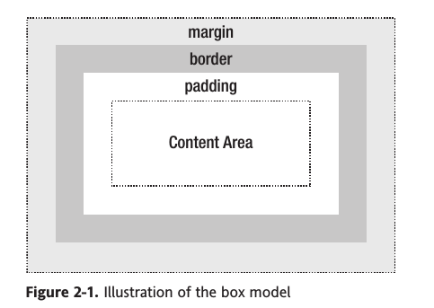

Title: Note on CSS Mastery
Date: 2015-11-22 23:35:58
Category: Note

## Setting the foundations ##

* Structing your code
* Use meaningful markup

## Visual formatting model recap ##



## Background images and image replacement ##

```css
#branding {
    width: 700px;
    height: 200px;
    background:url(/images/branding.gif) no-repeat;
}
```

## Styling links ##

```css
a[href^="http:"] {
    background: url(images/externalLink.gif) no-repeat right top;
    padding-right: 10px;
}
```

## Styling lists and creating nav bars ##

#### add image to list ####

```css
li {
    background: url(bullet.git) no-repeat 0 50%;
    padding-left: 30px;
}
```

#### navbar ####
文本

```html
<ul>
    <li><a href="#">Home</a></li>
    <li><a href="#">About</a></li>
</ul>
```

样式

```css
ul {
    margin: 0;
    padding: 0;
    list-style: none;
    width: 720px;
    background: #EAA819;
}

ul li {
    float: left;
}
```

## Styling forms and data tables ##

## Layout ##

* html
* body
* table
* tr, td
* iframe

## Hacks and Filters ##

## Bugs and bug fixing ##
