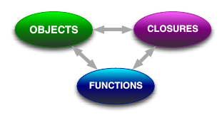
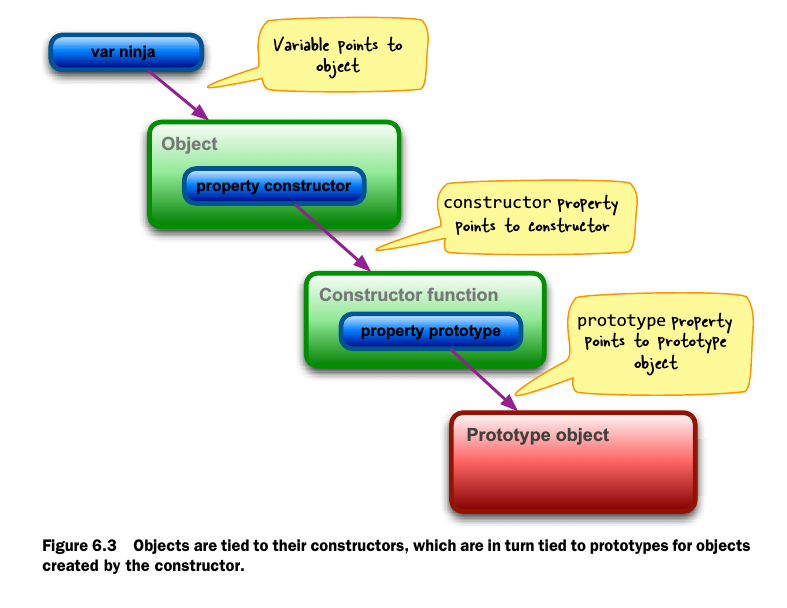
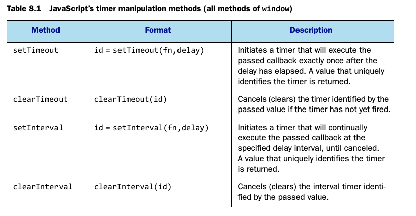

Title: Note on Sectets of the Javascript Ninja 
Date: 2015-11-22 13:53:52
Category: Note

## Enter the ninja ##
Javascript consists of a close relationship between objects, functions
and closures.

## Arming with testing and debugging ##
    :::javascript
    function log() {
        try {
            console.log.apply(console, arguments);
        }catch(e){
            try{
                opera.postError.apply(opera, arguments);
            }catche(e){
                alert(Array.prototype.join.call(arguments, " "));
            }
        }
    }

## Functions are fundamental ##

* The scope of declaration within a function differs from that of most
  other languages. Specifically:
  1. Variables within a function are in scope from their point of
     declaration to the end of the function, spanning block
     boundaries.
  2. Inner named functions are available anywhere within the enclosing
     function, even as forward references.

* The parameters list of a function and its actual argument list can
  be of different lengths:
  1. Unassigned parameters evaluate as undefined.
  2. Extra arguments are simply not bound to parameter names.

* Each function invocation is passed two implicit parameter names
  1. arguments, a collection of the actual passed arguments
  2. this, a reference to the object of the object serving as the
     function context

* Functions can be invoked in various ways, and the invocation
  mechanism determines the function context value:
  1. when invoked as a simple function, the context is the global
     object(window).
  2. When invoked as a method, the contect is the object owning the
     method.
  3. When invoked as a constructor, the context is a newly allocated
     object.
  4. When invoked via the apply() or call() methods of the function,
     the context can be whatever the heck we want.

## Wielding functions ##

* Anonymous functions let us create smaller units of execution rather
  than large functions full of imperative statements.
* Functions can have properties and those properties can be used to
  store any information we might wish to use.

## Closing in on closures ##

* Binding function context
* Partially applying functions
* Overriding function behavior
* Immediate function
  :::javascript
  (function(){})()
  1. Temporary scope and private variables
  2. Loops
  3. Library wrapping

## Object-orientation with prototypes ##

## Wrangling regular expressions ##

    :::javascript
    var re1 = /test/i;
    var re2 = new RegExp("text", "i");

## Taming threads and timers ##

## Ninja alchemy:runtime code evaluation ##

* use `eval()` to create runtime code evalution
* Json conversion
* moving definitions between namespaces
* minimization and obfuscation of Javascript code
* dynamic code rewriting and injection
* creating metalanguages

## With statements ##

* The use of `with` should be avoid.

## Developing cross-browser strategies ##

* Reusable cross-browser development involves juggling three factors:
  1. Code size -- Keeping the file size small
  2. Performance overhead -- Keeping the performance level above a
     palatable minimum
  3. API quality -- Making sure that the APIs provided work uniformly
     across browsers

## Cutting through attributes, porperties, and CSS ##

* Versions of IE prior to IE 9 don't allow the type attribute of
  <input\> elements to be changed once the element is part of the DOM
* The style attribute poses some unique challenges and doesn't contain
  the computed style for the element
* Computed style can be fetched from the window using standardized API
  in modern browsers, and via a proprietary property on IE 8 and
  earlier

## Surviving events ##

* addEventListener()
* removeEventListener()

## Manipulating the DOM ##

* Injecting HTML into a page
* Cloning elements
* Removing elements
* Manipulating element text

## CSS selector engines ##

