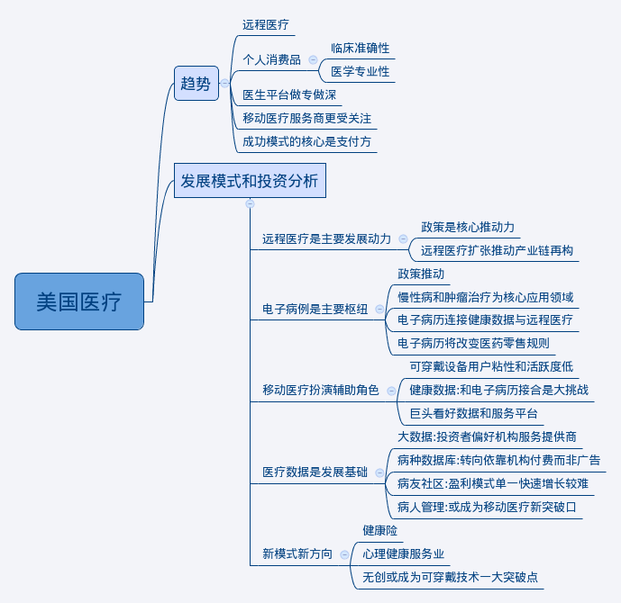
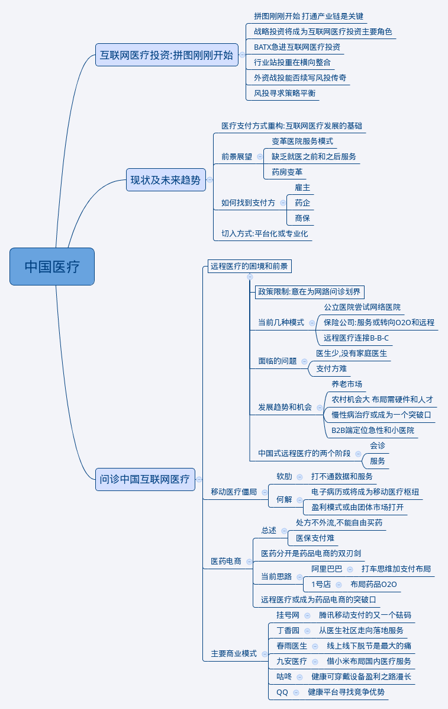

Title: <互联网医疗大棋局>笔记
Date: 2015-11-20 22:03:37
Category: note

## 互联网医疗之美国篇 ##

## 互联网医疗之中国篇 ##

#### 三问中国互联网医疗 ####
1.一问互联网医疗: 进入后流量时代?

 * 互联网发展逐渐成熟后,更加注重个性化需求, 产品会更加分化专注于某类
     特点,要大众化一窝蜂的模式不太可能.
 * 医疗不同于其他领域,需求本身更加专业和细分.
 * 后流量时代意味着快速积聚人气然后通过平台效应或者广告盈利的方式不
     太可能.
 * 个人是相对吝啬的,健康是需要花钱的, 移动医疗不应该由个人用户来买单.

2.二问互联网医疗:如何找到付费方?

* 美国移动医疗的快速发展主要得益于保险公司和雇主这两大支付方,个人很
     少在这一领域进行支出. 而在中国,完全缺乏上述的服务链.

3.三问互联网医疗:大平台没有优势?

* 医疗不是软需求,用户不会被广告吸引去花钱.
* 正因为用户要求很实际,解决了问题就走,解决不了就找其他,现在的大平台
     并不能高枕无忧,后来者也不是没有机会.

#### 概要 ####

