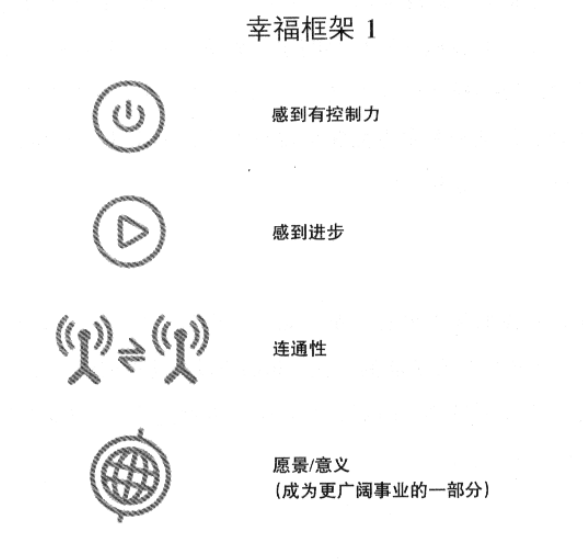
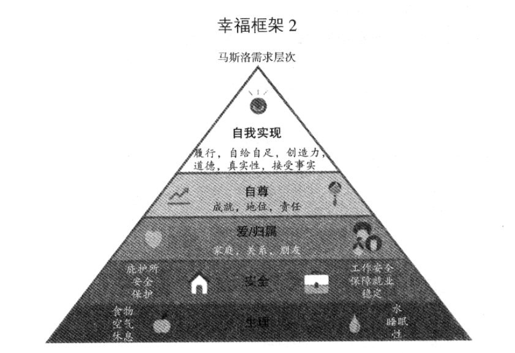
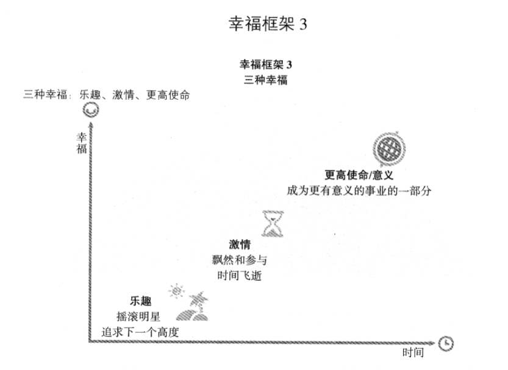

Title: 
Date: 2015-11-28 12:33:30
Category: 

## 利润 ##

#### 一些教训 ####

** 评估市场机会 **

* 选择市场是你可以做的最重要的决策
* 如果你发现在现在的市场上很难取胜,可以换个市场
* 如果竞争者太多,即使你是最优秀的,也难以取胜

** 市场开发和品牌化 **

* 大智若愚,百折不挠,懂得适时虚张声势
* 你的"品牌"很重要
* 对人们津津乐道的关于你的故事进行加工

** 财务 **

* 总是做好准备应对可能出现的最坏情况
* 赢得局数最多的玩家不一定是最后赢得最多的玩家
* 从来没有失手的玩家一定不是最后赢得最多的玩家
* 要追求高预期值,而不是低风险
* 确保有足够的资金能支付游戏费用及须承担的风险
* 只玩你输得起的游戏
* 记住这是一场持久战.你可能在短期内失败或者成功,但只有最终的结局才
      算数.

**战略**

* 不要玩你一窍不通的游戏,即使你看到很多人在这场游戏中赚到很多钱
* 在赌注不大的时候就弄明白游戏是怎么玩的
* 不要作弊. 从长远角度看,作弊者都是输家
* 坚持你的原则
    * 随着游戏的动态变化随时调整你的游戏风格,灵活点.
    * 耐心点,想得远些
    * 最有耐力, 最能专注的玩家通常是赢家
    * 与其他玩家有所区别, 与其他人反向行事
    * 空怀希望并不是一个好计划
    * 别让自己走歪了,休息一下,四处转转.

**不断的学习**
    * 自我教育.看书及向过来人学习.
    * 从实践中学习.理论很好,但是经验是无可取代的.
    * 把自己置于高手的圈子里,向他们学习.
    * 赢了一把,并不意味着你很优秀.可能只是运气好.
    * 不要害怕征求建议.

**文化**
    * 你必须爱上这个事业
    * 不要狂妄自大,华而不实,因为人外有人
    * 态度要和蔼,要广交朋友
    * 与他人分享你所学到的
    * 超越你现在正在参与的游戏,寻找更多的机会.
    * 玩的开心.如果目的不仅在于赚钱,那事情会变得更有趣.

## 利润与激情 ##

#### 美捷步文化 ####

1. 通过服务让人们感到惊叹: WOW!
2. 拥抱并驱动变革
3. 创造欢乐及一点点搞怪
4. 勇于冒险,敢于创新,开放思想
5. 积极进取和不断学习
6. 通过沟通建立开放和诚实的关系
7. 建立积极的团队,塑造家庭精神
8. 追求事半功倍
9. 充满激情和决断力
10. 虚怀若谷

## 利润,激情和使命 ##

