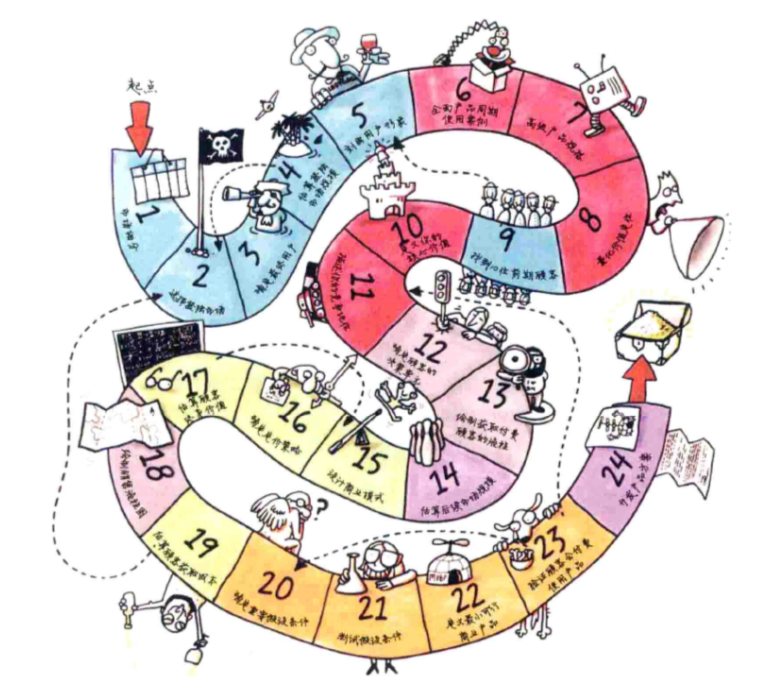
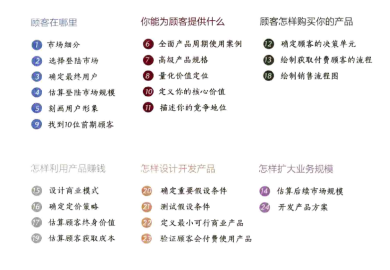

Title: 自律型创业
Date: 2015-11-28 22:55:33
Category: Note

* 创业指的是开创别人未曾经营过的新业务.
* 创新 = 发明创造 X 商业化

## 市场细分 ##

**充分必要条件**  
商业成功的唯一充分必要条件是付费顾客

**建立可以控制的新市场**  
对初创企业来说,开发现有市场无法提供的创新产品是取得成功的重要条件.通过
创立新市场,即使无法垄断,你也能在市场中占据很高的份额,然后在此基础上进
行业务扩张.

** 付费顾客可能带来的问题 **  
你应当精打细算,把有限资源应用到你能控制的,经过精挑细选和严格定义的新市
场中.

** 复杂的顾客: 第一类顾客,第二类顾客和双边市场 **  
有以下两种情况会顾客复杂化:

* 一是商业模式需要第一类顾客(最终用户)和第二类顾客(经济型买方)的同时参
  与才能赚钱
* 二是双边或多边情况,在这里你需要维护多个目标顾客群体才能实现业务.

**如何进行市场细分**

* 集思广益,列举出潜在的顾客群体和市场
* 把目标缩小到其中最有前景的6~12个市场
* 针对这6~12个市场搜集调查资料

## 选择登陆市场 ##

**如何选择登陆市场**  
最好不要选择最大或较大的市场,哪怕它们看起来成功的希望最高.你要进入的第
一个市场具有重要的学习意义,你应当选择一个规模较小的市场快速占领份额,让
潜在顾客熟悉你.

**登陆市场需要继续细分**  
定义市场的三个条件

1. 市场中的顾客都购买类似产品
2. 市场中的顾客具备相似的销售循环,期望产品以相似方式提供价值.
3. 顾客在市场中形成口碑效应.

选择一个市场出击,继续对市场进行细分,直到找到准确定义的同质化市场机会满
足本节提出的三个条件.记住,只有"关注"你才会赢.

## 确定最终用户 ##
对目标顾客的分析可以说永无止境,最终用户信息可以为后面的步骤指明方向.创
业之路刚刚开始,首先要做是选对目标,即严格定义的目标顾客.做好这一步非常
关键,因为它决定着你能否找到真实有效的顾客.

## 估算登陆市场规模 ##
* 自下而上式分析
  根据原始市场调查确定的潜在顾客数量,然后以此为基础推断其他市场的顾客
  数量,这种方法能够更准确地反映真实市场信息.
* 自上而下式分析
  利用市场分析报告,在缺乏直接沟通和验证的基础上推断顾客数量.  
由于第二种方法会遗漏某些重要的细微之处,最好结合两种方式确定市场中的顾
  客数量.

## 刻画用户形象 ##

**怎样选择和刻画用户形象**

* 刻画用户形象是一个很重要的过程,需要调动团队所有成员参与
* 根据你对用户获得的已知信息,制作一份说明清单

**刻画用户形象不只是一项练习**

用户形象是在整个创业过程中贯穿始终的,它应当成为企业制定任何决策的出发
点.

**用户形象能帮助你关注该做和不该做的事**

刻画用户形象可以登陆市场中的顾客提供特定细节.现在你要销售的目标不是泛
泛而谈的"最终用户",二是真实具体的个人.整个创业团队都要参加这项工作,这
样才能确保每个人都能感知和了解同一个人物形象,进而保证对顾客的持续关注.在
此过程中,你必须深入了解顾客的采购标准和优先级别.你必须真实了解顾客,明
白他们的一言一行.你不能只停留在理性分析的水平,而是要进一步了解他们的情
绪和社交活动.

## 全面产品周期使用案例 ##

为产品创建可视化全面周期使用案例,它能帮助你了解产品怎样融入顾客的价值
链,以及顾客在产品使用过程中会遇到哪些障碍.注意,只说明顾客如何使用产品
还不够准确,无法帮助你了解向目标顾客销售产品时会碰到哪些问题.

## 高级产品规格 ##

**设计产品宣传册**

以视觉化方式展示产品可以让你的团队和潜在顾客达成共识,了解其具体形态和
价值所在.你应当从高处着眼介绍产品,不要纠缠于各种细节或产品原型,这样不
但有利于产品的快速迭代,而且能在创业早期阶段节省宝贵的时间和资源.

## 量化价值定位 ##

量化价值定位针对的是用户形象的首要关注问题.首先你要利用全面周期使用案
例,了解并使用顾客熟悉的方式描述当前产品或解决方案的使用状况;然后说明使
用你的产品可能实现的效果,注意指出新产品可为顾客首要关注的问题带来哪些
价值.最好采用图形化单页的说明方式,它能让顾客马上明白你的价值定位,然后
加以分析验证.

## 找到10位前期顾客 ##

找到10位潜在顾客并和对方当面交流,这样做可以保证你的用户形象准确无误,保
证你关于顾客的其他假设有效成立.如果能做好这一步,然后对前面存在问题的步
骤进行微调,后面的创业步骤就会变得更有可行性.

## 定义你的核心价值 ##

* 核心价值指的是你能以超越竞争对手的效率为顾客带来的收益.
* 定义核心价值更多的是一种自我认识而非基于调查所做的分析.
* 核心价值一旦确定就不要轻易改变,你应当持续不断地强化这一优势.核心价值
  经常变动是个很不好的兆头,它表明你无法有效形成持续开发的能力.

## 描述你的竞争地位 ##

确定竞争地位能快速验证你的产品和竞争对手有何差距,你需要根据顾客优先关
注的两大需求了解消费者当前的行为模式.

## 确定顾客的决策单元 ##

确定了如何为顾客创造价值,接下来要了解的是顾客怎样购买你的产品.要想成功
做到这一点,你必须清楚做出最终采购决策的是是谁,以及可能影响采购决策的人
有哪些.

## 绘制获取付费顾客的流程 ##

确定获取付费顾客的流程能够说明决策单元是如何决定购买产品的,它还能揭示
一些阻碍企业销售产品的隐形障碍.从过长的销售周期到无法预料的政府规定,销
售产品要比满足用户形象的需求困难的多.这一步可以确保你及时发现销售流程
中所有的潜在陷阱.

## 估算后续市场规模 ##

估算后续市场是一项快速验证工作,它能证明你的产品未来会有更大的销售市场,
而且能有效激励团队成员和投资者者,让他们意识到你的企业同时具备短期和长
期发展潜力.

## 设计商业模式 ##

商业模式的选择会对企业的盈利能力产生重要影响.评估盈利能力有两个重要指
标,分别是顾客终身价值和顾客获取成本.  
商业模式确定之后再改变会很困难,因此,你选择的商业模式必须能够体现企业和
竞争对手的不同和优越之处,因此对方也很难改变商业模式和复制你的优势.

## 确定定价策略 ##

定价的实质是确定你的产品能为顾客创造多少价值,然后从中抽取一定的比例作
为回报.在确定产品价格的过程中,成本其实是无关因素.

## 估算顾客终身价值 ##

计算顾客终身价值是要了解新顾客平均可为企业创造多少利润,计算时须扣除资
本成本.计算顾客终身价值要非常务实,切记盲目乐观,要深入了解终身价值背后
的构成因素,这样你才明白该如何改善.顾客终生价值本身并无意义,必须和顾客
获取成本进行比较.

## 绘制销售流程 ##

销售流程包括产品宣传,顾客培育以及销售实现.销售流程可以推动顾客获取成本
的降低,顾客获取成本和顾客终身价值可以定义企业的盈利能力.

## 估算顾客获取成本 ##

在进行计算时千万不要盲目乐观,你要了解的是真实的数据而不是梦想的结果.

## 确定重要假设条件 ##

确定重要假设条件是验证原始市场调查过程的第一步,第二步是寻找顾客并观察
他们的具体行为是否符合假设条件.在进行测试之前可以把假设条件分解为更细
小的模块,保证每一条假设代表一个具体明确的方面,然后在下一步利用设计好的
实验方式加以测试.

## 测试假设条件 ##

测试重要假设条件,特别是那些具有重要意义的假设条件,如成本目标和灯塔型顾
客的采购兴趣,能帮助你有效做好产品销售准备.

## 定义最小可行商业产品 ##

最小可行商业产品的作用是对产品进行系统化测试,了解产品能否真正为顾客提
供价值.

## 验证顾客会付费使用产品 ##

确定顾客会不会为产品付费,会不会为你的产品宣传正面口碑.

## 开发产品方案 ##

正式进入市场

